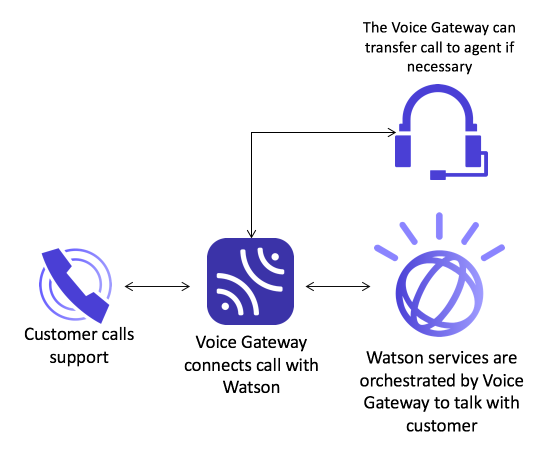

# sample.voice.gateway

This repository contains various samples and scripts to help you get started with the IBM&reg; Voice Gateway&trade;.

IBM&reg; Voice Gateway provides a Session Initiation Protocol (SIP) endpoint that orchestrates IBM&reg; Watson&trade; speech and conversation services to enable a cognitive agent that communicates with a caller using natural language. The voice gateway makes it possible to integrate a public or enterprise telephony system with Watson, enabling direct voice interactions with a cognitive self-service agent or the ability to access real-time transcriptions of a phone call between two people (e.g.  a customer and a contact center agent).



Within this repository you will find the following directories:

| Directory | Description |
| -------------- | --------------------------------------------------------------- |
| **\docker** | Contains sample **docker-compose.yml** files that can be used to launch the voice gateway docker images in your own docker environment.| 
| **\bluemix** | Contains scripts and **docker.env** files that can be used to deploy the voice gateway to the IBM&reg; Containers for Bluemix&reg; service.| 
| **\conversation** | Contains sample **docker-compose.yml** files that can be used to launch the voice gateway docker images in your own docker environment.| 
| **\kubernetes** | Contains contains scripts to help you get started with deployments of the voice gateway into a k8s environment.| 
| **\security** | Files to help customize security of the voice gateway.| 
| **\audio** | Audio files used in the sample conversation.| 
| **\soe** | Sample Service Orchestration Engine used to customize your voice conversation through the use of APIs.| 

### Pulling the IBM Voice Gateway Docker images
The voice gateway is made up of two separate Docker images that can be pulled using the following command:

```
 docker pull ibmcom/voice-gateway-so:latest

 docker pull ibmcom/voice-gateway-mr:latest
```
  
Read more about these images here:
  
[voice-gateway-so](https://hub.docker.com/r/ibmcom/voice-gateway-so/)

[voice-gateway-mr](https://hub.docker.com/r/ibmcom/voice-gateway-mr/)

### Usage
All the documentation related to the Voice Gateway and the use of the samples in this GitHub repository can be found here:

[IBM Voice Gateway Documentation](https://www.ibm.com/support/knowledgecenter/SS4U29/welcome_voicegateway.html)

If you want to deploy the voice gateway to IBM Containers on Bluemix, go here:

[Deploying to IBM Containers on Bluemix](https://www.ibm.com/support/knowledgecenter/SS4U29/deploybmix.html)

If you want to deploy the voice gateway to a Docker engine, go here:

[Deploying to Docker Engine](https://www.ibm.com/support/knowledgecenter/SS4U29/deploydocker.html)

If you're interested in setting up the voice gateway behind a Twilio SIP trunk, go here:

[Twilio integration](https://www.ibm.com/support/knowledgecenter/SS4U29/twilio.html)

### Become part of our community!

[](https://ibm-cloud-tech.slack.com/messages/ibmvoicegateway)

[Need an account on ibm-cloud-tech.slack.com? Click here to sign up.](http://ibm.co/2mblgXr)

### Licenses
The license related to the files found in this GitHub repository:

[Apache 2.0 License](https://github.com/WASdev/sample.voice.gateway.for.watson/blob/master/LICENSE)

The license for the IBM&reg; Voice Gateway Docker images can be found here:

[IBM Voice Gateway License](http://www14.software.ibm.com/cgi-bin/weblap/lap.pl?li_formnum=L-MCAO-AJTLXM&popup=n&title=IBM%20Voice%20Gateway)
